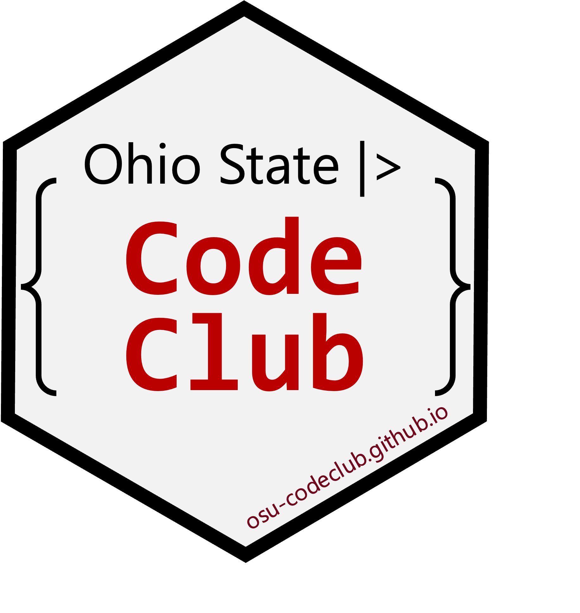

::::: columns
::: {.column width="45%"}
{fig-align="center" width="80%"}
:::

::: {.column width="55%"}
Code Club restarted for the 2026 spring semester on **February 2^nd^**,
meeting on **Mondays at 4 pm**.

Please **sign up** [using this Google form](https://forms.gle/eYkMvmJShrcANUrt5)
to be added to our mailing list and receive meeting locations and link info!

You are welcome to join at any time.
If you are a total R beginner, we do recommend you do some self-study using
[this material from a workshop we taught in Feb '26](https://osu-codeclub.github.io/carpentries-feb-2026/).

:::
:::::

| Session | Date     | Presenter | Topic & link                                       |
|---------|----------|-----------|----------------------------------------------------|
| S11E07  | Mar 23   | Jess      | [Iterating I](../posts/S11E07_functions_01/)                      |
| S11E08  | Mar 30   | Jess      | Iterating II                       |
| S11E09  | Apr 6    | Neel      | Writing your own R package II                      |
| S11E10  | Apr 13   | Neel      | Writing your own R package II                     |
| S11E11  | Apr 20   | Neel       | Writing your own R package III                              |
| S11E12  | Apr 27   | all       | Bring your own data                             |

: {.striped .hover}
