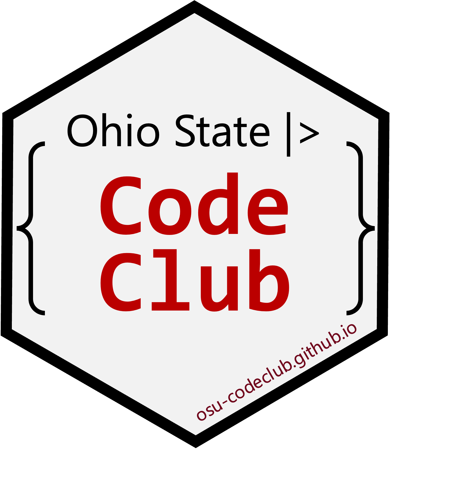

::::: columns
::: {.column width="30%"}
{fig-align="center" width="60%"}
:::

::: {.column width="70%"}

_Please **sign up** [using this form](https://forms.gle/eYkMvmJShrcANUrt5){target="_blank"}_
_to be added to our mailing list and receive more information and updates!_

_You are welcome to join Code Club at any time, and at any experience level._
_For total R beginners, we do recommend going over_
_[this workshop material we taught on Aug 17, 2026](https://osu-codeclub.github.io/carpentries-aug-2026)._
:::
:::::

::: {.callout-note appearance="simple"}
_In fall 2026, Code Club sessions will be held once a month on Thursdays from 3–5 pm._
:::

| Session | Date   | Presenter | Topic & link                       |
| ------- | ------ | --------- | ---------------------------------- |
| S12E01  | Aug 27 | Jelmer    | Getting started with Positron      |
| S12E02  | Sep 17 | Jess      | AI assistance with Posit Assistant |
| S12E03  | Oct 22 | Horacio   | AI assistance use case I: TBA      |
| S12E04  | Nov 19 | Jelmer    | AI assistance use case II: TBA     |
| S12E05  | Dec 3  | Jess      | Bring your own data                |

: {.striped .hover}
