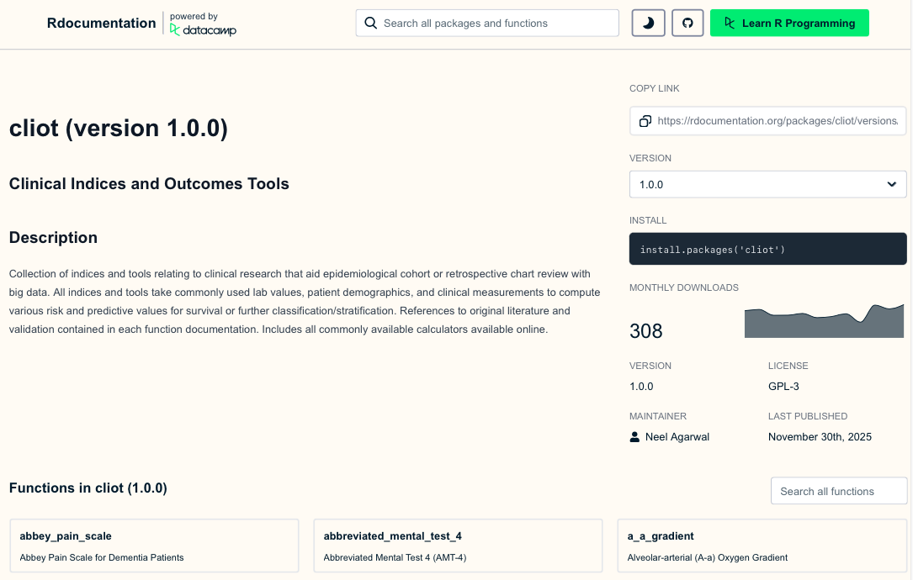

------------------------------------------------------------------------

<br>

## Introduction: Why build an R Package?

```{r, fig.alt = "Illustration of an open cardboard box with the R logo on it, with plots and tables flying out of it.", fig.cap= "Packaging your code saves future you a lot of time.", out.width = "100%", fig.align = "center", echo = FALSE}
knitr::include_graphics("img/package-box.png")
```

When you first learn R, you write scripts to get a specific job done. As you progress, you might find yourself copying and pasting the same 30 lines of ggplot2 code across different projects just to make sure your axis labels match your lab's publication standards. Or, you might have a specific way you always format your summary statistic tables.

Copying and pasting is generally not a good idea. It is error-prone, inefficient, and creates a nightmare if you decide to change a single color in your lab's theme—you'd have to update it in dozens of scripts!

The solution is writing an R package. A common misconception is that R packages are only for sharing groundbreaking new statistical methods on CRAN. In reality, the most useful packages are often internal or personal packages. By bundling your custom functions, themes, and templates into a package, you ensure:


<!-- added bullets -->
- Reproducibility: Your code behaves identically across all your projects.
- Efficiency: You load your tools with a single library(myLabTools) command.
- Collaboration: You can easily share your exact workflow with colleagues.

<!-- added another header -->
### An R package example

An example of an R package I, Neel, made was in order to solve an issue that recurs in the field of health sciences often - what is the best (standardized) way to code for various clinical indices? For instance, everyone might code a fibrosis index differently in a programming language due to logical nuances or due to complex logic, omit it entirely due to technological complexity. To solve this issue, I spent around 1.5 years coding every single clinical formula into R as a simple programming workflow to ensure this issue wouldn't be faced!

This is a helpful resource whenever you want to see documentation for packages online, and you can find many more on rdocumentation.org! By lesson 3, you will have all the tools to have your own package listed on rdocumentation.org, and published to the entire R community to download and use for their own purposes! 

```{r, fig.alt = "Illustration of an open cardboard box with the R logo on it, with plots and tables flying out of it.", fig.cap= "Packaging your code saves future you a lot of time.", out.width = "100%", fig.align = "center", echo = FALSE}

```

<!-- added some markdown formatting and links -->
Today, we are going to focus on:

- Setting up an R package skeleton using the [`usethis`](https://usethis.r-lib.org/) package.

- Understanding how to pass unquoted variable names into functions (Tidy Evaluation).

- Writing a function for a publication-ready `ggplot2` histogram.

- Writing a function for a professional summary table using `gt`.

- Let's start by loading the tools we will use to build and test our new package.

```{r}
library(devtools) # Core package development tools
library(usethis)  # Automates the tedious parts of package setup
library(tidyverse) # For ggplot2 and dplyr
library(gt)       # For generating professional tables
library(palmerpenguins) # For testing our functions with real data
```

<!-- added headers -->
<!-- added to this section some links and more markdown formatting to call out specifically packages names -->
## Creating Your Package Skeleton
### The Basics of `usethis`

Historically, setting up an R package meant manually creating specific folders (R/, man/), writing a strictly formatted DESCRIPTION file, and managing a NAMESPACE. It was tedious and frustrating.

The `usethis` package automates all of this boilerplate work. It sets up the exact directory structure R expects.

<!-- converted your Important Note to a callout-tip -->
::: {.callout-tip}
## Run this in your console!
You should run this command directly in your console, pointing to a new directory outside of your current project workspace. Do not nest an R package inside an existing R Project.
:::

To create a new package, you simply use the [`create_package()`](https://usethis.r-lib.org/reference/create_package.html) function.

```{r, eval = FALSE}
# Create a new package called "vizwizard" on your desktop
usethis::create_package("~/Desktop/vizwizard")
```

Running this will open a brand new RStudio session. Take a look at the Files pane—you'll see a DESCRIPTION file (which holds metadata about your package) and an R/ folder.

The R/ folder is where all your custom functions will live. We never create R scripts manually in a package. Instead, we use use_r() to generate them properly.

```{r, eval = FALSE}
# Create a script to hold our plotting functions
usethis::use_r("plots")

# Create a script to hold our table functions
usethis::use_r("tables")
```

<!-- added a header -->
### Writing a Plotting Function
The Problem: Functions and ggplot2

Let's say you want to write a function that takes a dataset and plots a histogram of a specific variable. A naive approach might look like this:

```{r}
# THIS WILL NOT WORK!
bad_histogram <- function(data, my_variable) {
  ggplot(data, aes(x = my_variable)) +
    geom_histogram()
}
```

<!-- added code in backticks -->
If you try to run `bad_histogram(penguins, flipper_length_mm)`, R will throw an error saying object 'flipper_length_mm' not found.

Why? Because R is looking for a standalone object named flipper_length_mm in your global environment, rather than looking inside the penguins dataset. Standard ggplot2 functions know how to look inside the dataframe, but our custom function doesn't automatically pass that behavior along.

<!-- added a header -->
### The Solution: Tidy Evaluation and {{ }}

To solve this, we use something called Tidy Evaluation, specifically the "curly-curly" operator: {{ }}.

Wrapping our variable arguments in {{ }} tells R: "Don't evaluate this right now. Wait until you are inside the ggplot2 or dplyr function, and then evaluate it in the context of the provided dataframe."

Let's write a proper function inside our new R/plots.R file. We will create a standardized, publication-ready histogram.

```{r}
#' Create a Publication-Ready Histogram
#'
#' @param data A dataframe
#' @param var A numeric variable to plot (unquoted)
#' @param title A string for the plot title
#' @return A ggplot object
#' @export
pub_histogram <- function(data, var, title = "Histogram") {
  
  # Notice the curly-curly around 'var'
  ggplot(data, aes(x = {{ var }})) +
    geom_histogram(fill = "#2c3e50", color = "white", bins = 30) +
    theme_classic(base_size = 14) +
    theme(
      plot.title = element_text(face = "bold", hjust = 0.5),
      axis.title = element_text(face = "bold"),
      panel.grid.major.y = element_line(color = "grey90", linetype = "dashed")
    ) +
    labs(title = title, y = "Count")
}
```

Let's test it out using our penguins dataset to see if our custom styling is applied automatically!

```{r}
# Test our new function
pub_histogram(penguins, flipper_length_mm, "Penguin Flipper Lengths")
```

<!-- added a header and some backticks around package/file names-->
### Writing a Professional Table Function
The same {{ }} rules apply when writing wrappers for `dplyr` pipelines and `gt` tables.

Let's write a function for `R/tables.R`. We want to take any dataset, group it by a categorical variable, summarize a numeric variable (getting the Mean, SD, and Count), and output a clean, styled HTML table using the gt package.

```{r}
#' Create a Summary Statistics Table
#'
#' @param data A dataframe
#' @param group_var A categorical variable to group by (unquoted)
#' @param sum_var A numeric variable to summarize (unquoted)
#' @return A gt table object
#' @export
pub_summary_table <- function(data, group_var, sum_var) {
  
  data %>% 
    # Remove NAs specifically for the columns we care about
    drop_na({{ group_var }}, {{ sum_var }}) %>% 
    group_by({{ group_var }}) %>% 
    summarize(
      Mean = mean({{ sum_var }}),
      SD = sd({{ sum_var }}),
      N = n()
    ) %>% 
    # Pass the summarized data into gt()
    gt() %>% 
    tab_header(
      title = md("**Summary Statistics**")
    ) %>% 
    fmt_number(
      columns = c(Mean, SD),
      decimals = 2
    ) %>% 
    # Apply a built-in clean theme
    opt_stylize(style = 1, color = "blue")
}
```

Let's test our table function to quickly summarize penguin body mass by species!

```{r}
pub_summary_table(penguins, species, body_mass_g)
```


::: {.callout-warning}

To run this command, you can simply select all the text and hit Command + Enter (on mac) or Ctrl + Enter (on windows) or the Run All button to see your result pop up in the plot viewer on the right!

Remember, while you can/should put the `pubscatter()` command in the same file as the `function()` for evaluation purposes (to test if your code works), remember to delete this line before you build/compile/send your package out for others to use. 
:::


<!-- added a header and backticks around function -->
### Practice
Your Turn: Custom Scatterplot

Write a function called pub_scatter that takes a dataset, an x variable, a y variable, and a color variable, and returns a cleanly formatted scatterplot.

<details>

<summary>Need a hint?</summary>


Because you are passing unquoted variable names into `ggplot()`, you must remember to use the {{ }} operator for all of your variables (x, y, and color) inside the `aes()` wrapper.
</details>

<details>

<summary>Need another hint?</summary>


Start with a standard `ggplot()` call, then add `geom_point()`. Add `theme_minimal()` to quickly clean up the background, and `scale_color_viridis_d()` to ensure the colors are colorblind-friendly!
</details>

<details>

<summary>Click for the solution</summary>

```{r}
#' Create a Publication-Ready Scatterplot
#'
#' @param data A dataframe
#' @param x_var The variable for the x-axis (unquoted)
#' @param y_var The variable for the y-axis (unquoted)
#' @param color_var The variable to color points by (unquoted)
#' @return A ggplot object
#' @export
pub_scatter <- function(data, x_var, y_var, color_var) {
  
  ggplot(data, aes(x = {{ x_var }}, y = {{ y_var }}, color = {{ color_var }})) +
    geom_point(size = 3, alpha = 0.8) +
    theme_minimal(base_size = 14) +
    theme(
      legend.position = "bottom",
      plot.title = element_text(face = "bold")
    ) +
    scale_color_viridis_d() # Use a colorblind friendly palette
}

# Test it out
pub_scatter(penguins, flipper_length_mm, body_mass_g, species) +
  labs(title = "Penguin Size by Species")
```

</details>

::: {.callout-warning}

Remember, while you can/should put the `pubscatter()` command in the same file as the `function()` for evaluation purposes (to test if your code works), remember to delete this line before you build/compile/send your package out for others to use. 
:::


The "Metadata": DESCRIPTION, Documentation, and NAMESPACE
Writing the functions is only half the battle. To make your code a true R package, R needs to know some metadata: what the package is called, who wrote it, what other packages it relies on, and how users can get help.

The DESCRIPTION File

<!-- added backticks -->

When we ran `usethis::create_package()`, it automatically generated a file called DESCRIPTION in our project directory. If you click on it in the Files pane, it looks something like this:

Package: vizwizard
Title: What the Package Does (One Line, Title Case)
Version: 0.0.0.9000
Authors@R: 
    person("First", "Last", , "first.last@example.com", role = c("aut", "cre"),
           comment = c(ORCID = "YOUR-ORCID-ID"))
Description: What the package does (one paragraph).
License: `use_mit_license()`, `use_gpl3_license()` or friends to pick a license
Encoding: UTF-8
Roxygen: list(markdown = TRUE)
RoxygenNote: 7.2.3

This is the ID card of your package. As a package developer, you should fill out the Title, update the Authors@R with your own information, and write a brief Description.

<!-- added backticks -->
### Handling Dependencies

Our custom functions use `ggplot2`, `dplyr`, and `gt`. If a colleague installs `vizwizard`, R needs to know to install those packages for them, too.

A golden rule of package development: never type package names into the DESCRIPTION file manually. It is too easy to make a typo or format it incorrectly. Instead, let usethis do the heavy lifting safely:

```{r, eval = FALSE}
# Run these directly in your console to add dependencies to your DESCRIPTION file
usethis::use_package("ggplot2")
usethis::use_package("dplyr")
usethis::use_package("gt")
```

you check your DESCRIPTION file now, you'll see a new Imports: section listing these packages!

Generating Manual (man/) Files with roxygen2

Whenever you get stuck in R, what do you do? You type ?function_name into the console to pull up the help file. Those help files live in the man/ (manual) folder of a package.

Historically, writing these .Rd (R documentation) files was a nightmare of custom formatting. Today, we use the roxygen2 package to make it incredibly easy.

If you look back at our pub_histogram and pub_summary_table functions from earlier, you'll notice I snuck in some special comments starting with #' right above the code:

```{r}
#' Create a Publication-Ready Histogram
#'
#' @param data A dataframe
#' @param var A numeric variable to plot (unquoted)
#' @param title A string for the plot title
#' @return A ggplot object
#' @export
```

These are roxygen comments!

@param defines the arguments your function takes.

@return explains what the function outputs.

@export is crucial: it tells R to make this function available to the public when they run library(vizwizard). Without it, the function is "internal" and hidden from the user.

added headers and backticks
### Putting it all together: `devtools::document()`

Right now, those are just comments in a script. To actually generate the help files and update our package's metadata, we run one magical command in the console:

```{r, eval = FALSE}
# Translates your #' comments into actual help files!
devtools::document()
```

When you run this, two amazing things happen:

The man/ folder is populated: You will see files like pub_histogram.Rd appear in your file directory. You can now type ?pub_histogram into your console to see your very own custom help page!

The NAMESPACE file is updated: This file acts as the "border control" of your package, explicitly listing which functions are @exported for public use. Just like the dependencies, never edit the NAMESPACE file by hand. Let devtools::document() handle it.

### Bonus Practice: The "Jitter" Boxplot

Boxplots are great, but showing the raw data points on top of them is even better for transparency.

Write a function called pub_boxplot that takes a dataset, a categorical variable for the x-axis, and a numeric variable for the y-axis. It should return a cleanly formatted boxplot with the raw data points overlaid as a "jitter" plot.

<details>

<summary>Need a hint?</summary>

Just like the scatterplot, you will need to use the {{ }} operator for your x and y variables inside aes(). You might also want to set fill = {{ x_var }} so each box gets its own color!

</details>

<details>

<summary>Need another hint?</summary>

You will need two geoms for this: geom_boxplot() and geom_jitter().
To make it look professional, try making the jittered points slightly transparent by setting alpha = 0.5 inside geom_jitter(), and remove the redundant legend using theme(legend.position = "none").

</details>

<details>

<summary>Click for the solution</summary>

```{r}
#' Create a Publication-Ready Boxplot with Jittered Points
#'
#' @param data A dataframe
#' @param cat_var A categorical variable for the x-axis (unquoted)
#' @param num_var A numeric variable for the y-axis (unquoted)
#' @return A ggplot object
#' @export
pub_boxplot <- function(data, cat_var, num_var) {
  
  ggplot(data, aes(x = {{ cat_var }}, y = {{ num_var }}, fill = {{ cat_var }})) +
    # Add the boxplot, making the outliers invisible since we are plotting raw points anyway
    geom_boxplot(outlier.shape = NA, alpha = 0.7) +
    # Add the raw data points, slightly jittered so they don't overlap perfectly
    geom_jitter(width = 0.2, alpha = 0.5, color = "black") +
    theme_minimal(base_size = 14) +
    theme(
      legend.position = "none", # Hide the legend since the x-axis already labels the groups
      plot.title = element_text(face = "bold"),
      panel.grid.major.x = element_blank() # Clean up vertical grid lines
    ) +
    scale_fill_viridis_d(option = "mako") # Use a clean, colorblind-friendly palette
}

# Test it out
pub_boxplot(penguins, species, bill_length_mm) +
  labs(
    title = "Penguin Bill Length by Species",
    x = "Species",
    y = "Bill Length (mm)"
  )
```

</details>


