------------------------------------------------------------------------

<br>

## Introduction

### What we'll cover

Every Code Club session so far has used **RStudio**.
Today we'll spend the session in a different program:
**[Positron](https://positron.posit.co/)**,
a newer data science IDE from Posit, the same company that makes RStudio.

By the end of the session, you should be able to open your own work in Positron,
find your way around, and decide for yourself whether you want to keep using it.
Specifically, we'll cover:

- **Installing Positron and opening a folder**
- **Touring the interface**
- **Exploring data** --- the Data Explorer, Variables pane, and Plots pane
- **Customizing Positron** --- keyboard shortcuts, settings, and extensions

### Why is there a new IDE?

Basically, Posit wanted better support for other programming languages,
particularly Python, alongside R.
This turned out to be harder with RStudio than starting fresh,
so they created a new IDE: Positron.

Positron is built on [Code OSS](https://github.com/microsoft/vscode),
the open-source version of the popular general-purpose code IDE called
Visual Studio Code (**VS Code**).
It adds data science features that RStudio has but VS Code does not,
such as a Variables pane, a Plots pane, and a Data Explorer.

::: exercise
####  Discussion {-}

- Which languages do you use besides R --- Python, bash, SQL, none?
- Has anyone tried Positron already? Did you stick with it?
- Do you consider yourself familiar with the basics of RStudio?
:::

### Why should you consider switching?

If you use Python alongside R, or are already familiar with VS Code,
Positron is a natural choice and I'd strongly recommend switching.

If you use R only, you may not need to switch, but should still consider it,
because:

- **New features**: While Posit has committed to maintaining and updating RStudio,
  major new features are now going to Positron first.
  And some features may never make it to RStudio, because Positron is more adaptable.

- **AI support**: This is much more flexible in Positron,
  where you can connect to different model providers and subscriptions,
  and even use Claude Code.
  In RStudio, you can only use AI via a Posit AI subscription.
  We'll demonstrate using AI assistance in Positron in the next session!

And two more minor points:

- **Data Explorer**: Positron's Data Explorer can open data files (CSV, Excel, etc.)
  directly, without having to load them in R at all.

- **Remote connections**: A niche feature, but it was important to me:
  Positron can be connected to the Ohio Supercomputer Center
  and any other remote server.
  This isn't possible with RStudio and while you can use RStudio directly at OSC
  through OSC OnDemand, this has its downsides.
  (Happy to expand on this for any OSC users!)

### Before we start

If you haven't done so already, please:

1. **Install Positron**: download the appropriate installer from
   the [download page](https://positron.posit.co/download.html){target="_blank"},
   and run it. There are installers for Windows, macOS, and Linux.

2. **Make sure you have a recent R** (4.4.0 or higher) installed;
   Positron does not come with its own copy of R.

::: {.callout-important}
#### Using an OSU-managed computer and have no admin rights?

You should still be able to install Positron,
just do so at the user level rather than system-wide.

On a Mac, this involves dragging the Positron app into your **User** Applications folder,
`/Users/<username>/Applications` (i.e. this Applications folder is in the same
parent folder as your Documents, Downloads, and Desktop folder).

On Windows, the Positron installer has a **"User install"** option.
Look for a checkbox or dropdown labeled **"Install for me only"** (vs. "for
all users") during setup --- that keeps the install in your user profile
without needing admin rights.
:::

## Getting started

Go ahead and start Positron! It should look something like this:

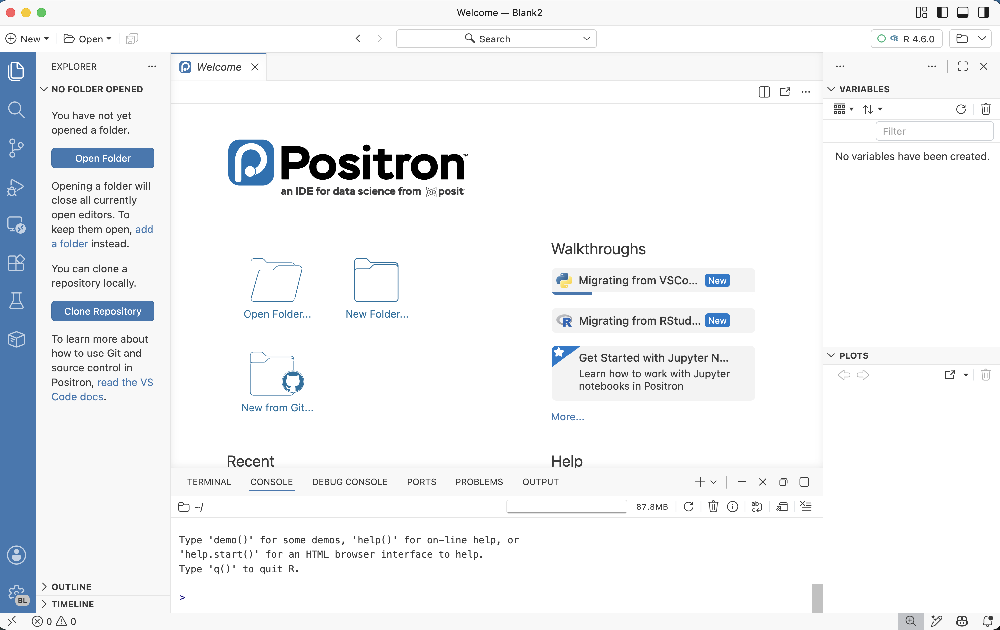{fig-align="center" width="98%" fig-alt="Screenshot of the Positron IDE, with the Editor, Console, and various panes"}

### Opening a folder (replaces RStudio Projects!)

::: {.columns}
::: {.column width="45%"}

When you first start Positron, you should see something like what's shown in the
screenshot on the right, prompting you to **open a folder**.

"Opening a folder" is Positron's **equivalent of opening an RStudio Project**.
The idea is the same: a folder is a self-contained workspace,
and opening it sets your working directory and gives you a fresh R session.

But instead of requiring the special `.Rproj` file that is created when you make
an RStudio Project, Positron simply **treats any folder you open as a project**.

 Let's create and open a new folder for today's session:

:::
::: {.column width="55%"}

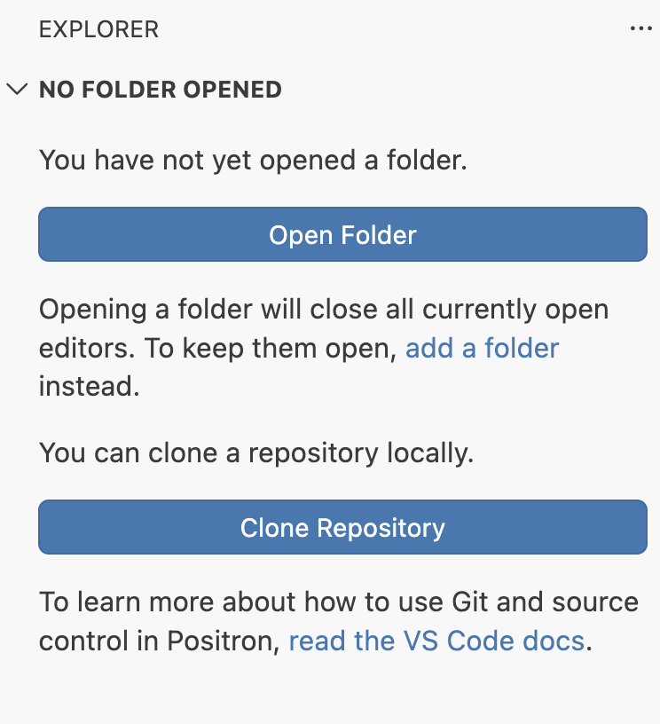{fig-align="center" width="85%" fig-alt="Positron welcome screen, with a button to open a folder"}

:::
:::

1. Create a new folder on your computer.
   You can create it in any way, such as with your File Explorer / Finder.

   I would suggest putting this folder within a folder for Code Club, for example:
   `Documents` > `codeclub` > `positron`
   (or put another way: `~/Documents/codeclub/positron`).

2. Open this folder in Positron by clicking the **Open Folder** button shown above^[
   Or if that's somehow not showing, by using the menu `File` > `Open Folder...`.].

3. Positron will reload and ask whether you want to trust the folder.
   Click **Yes, I trust the authors** and optionally check the box above it.

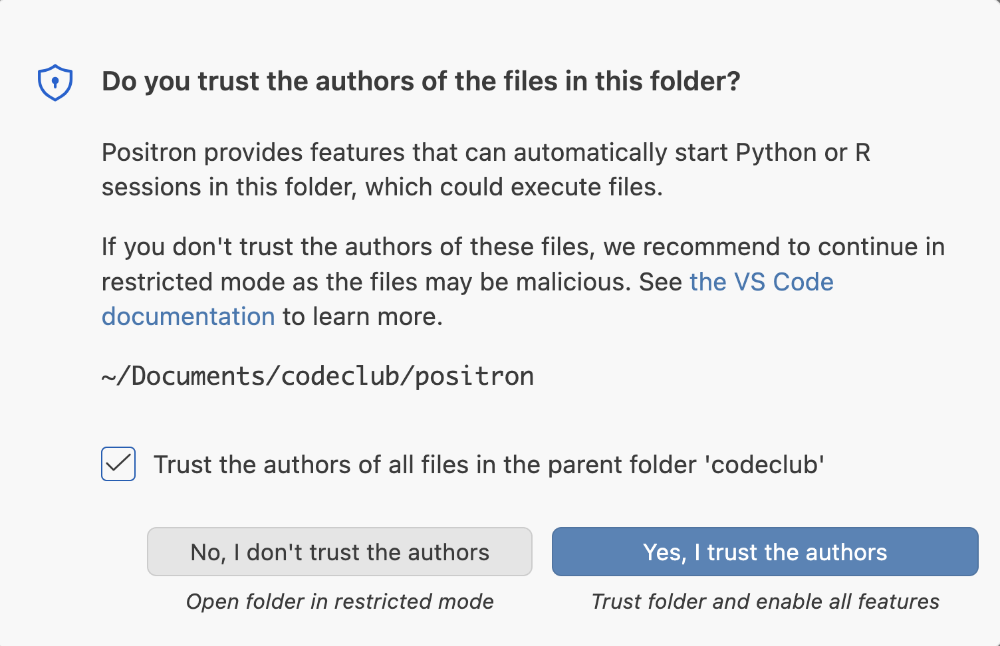{fig-align="center" width="70%" fig-alt="Positron dialog asking whether to trust the folder you just opened"}

**Why are Projects or open folders needed?**
These encourage good practices:

- Keep each research project in its own self-contained folder
- Use paths _relative_ to the folder root, not absolute paths
- Avoid using `setwd()`

They also make a lot of Positron's features work better, such as the Explorer,
Search, and version control support.

::: {.callout-note}
#### More on RStudio Projects vs. Positron folders

If you open a folder that already contains an `.Rproj` file,
Positron simply ignores the file.
So a folder can work as both an RStudio Project and a Positron workspace,
which is perhaps handy while you're trying Positron out.

The good thing about Positron's mechanism is that you're practically forced to use it,
whereas in RStudio using Projects is optional and easy to skip or not know about.
:::

### Starting an R session

::: {.columns}
::: {.column width="60%"}

Near the **top-right corner** of the Positron window is the so-called **interpreter picker**,
which lets you choose which installation of R (or Python) to use for your session.

If Positron found your R installation, it may have started a session already ---
then it would look like something on the right
(with the R version number corresponding to what you have installed).

:::
::: {.column width="40%"}

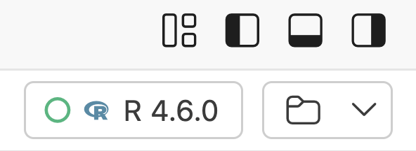{fig-align="center" width="90%" fig-alt="Screenshot of the Positron interpreter picker"}

:::
:::


**If not, click the picker**, and choose your version of R
(you may have to click **New Console Session** before you see the options).

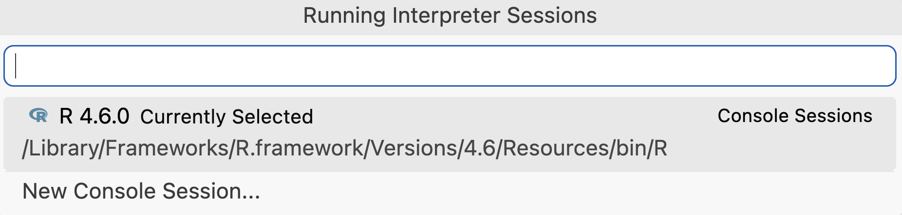{fig-align="center" width="80%" fig-alt="Screenshot of the Positron interpreter picker with options"}

::: {.callout-note}
#### More on R and Python sessions in Positron
The picker lists *every* interpreter Positron can find,
which could include several versions of R and Python.

Two nice features of Positron:

- Switching between R versions is a single click here,
  which is considerably easier than in RStudio.
- You can also have several sessions running at once.
  Say, an R session and a Python session, or two R sessions on different R versions.

On the other hand, if you're an R user only and have no need to switch between
different R versions,
you might prefer the simplicity of RStudio's approach.
:::

Once a session is running, the R **Console** works just like in RStudio.
Try it:

```{r}
1 + 1
```

```{r}
head(iris)
```

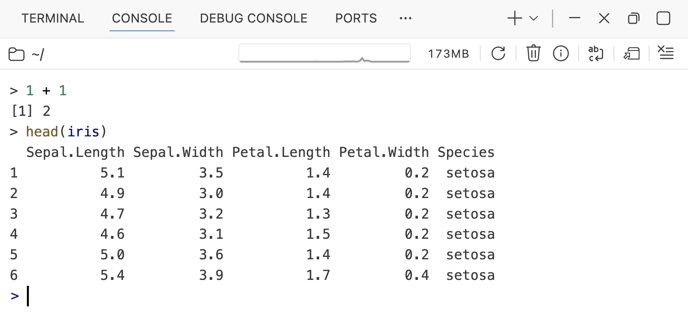{fig-align="center" width="90%" fig-alt="Screenshot of the Positron console, showing a simple calculation and the head of the iris dataset"}

::: exercise
####  Exercise {-}

<hr style="height:1pt; visibility:hidden;" />

**A) Confirm your working directory**

Confirm that opening a folder really did set your working directory:
run `getwd()` and check that the path matches the folder you opened.

**B) Try running two sessions**

Start a *second* R session from the interpreter picker
(click the picker, then **New Console Session**).
You likely only have a single R version installed,
and can pick the same version for the second session.

You should now have two Console sessions, and you can see this as shown in the screenshot:

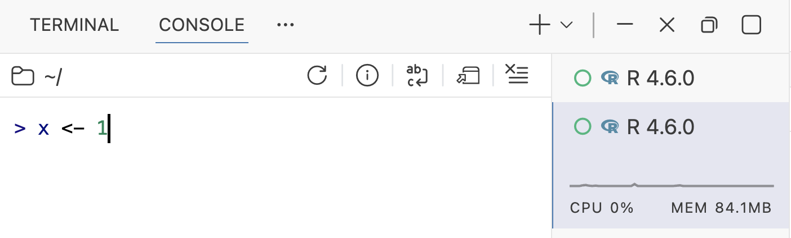{fig-align="center" width="80%" fig-alt="Screenshot of Positron with two console sessions"}

Click on the second (bottom) session, and run:

```{r, eval=FALSE}
x <- 1
```

Then switch back to the first session, and run:

```{r, error=TRUE}
x
```

If you get the above error, that means the two sessions are independent:
objects created in one session do not exist in the other.
:::

### Packages and a script

We'll use the `flights` dataset from the **nycflights13** package:
every flight that departed New York City in 2013.
I picked a relatively large dataset,
so we can see some of the nice features of the Data Explorer later.

First, let's install the packages we need:

```{r, eval=FALSE}
install.packages("tidyverse")
install.packages("nycflights13")
```

::: {.callout-tip}
#### Already have these packages installed?
If you already have them or think you do,
you can skip the installation step and try running the `library()` calls below directly.
Alternatively, it won't hurt to run the `install.packages()` calls again ---
R will simply check that you have the latest version and skip the installation if you do.
:::

Now, let's **create a new R script**:

- This can be done in several ways, but here is one:
  Click `File` (or the "New" button) > `New File...`, then select "R File".

- Save it right away
  (`File` > `Save` or `Save As`, or <kbd>Cmd</kbd>/<kbd>Ctrl</kbd>+<kbd>S</kbd>)
  in your current folder as `explore.R`.

I recommend that you **add all the code below to this script**,
and run it from the script (instead of typing it into the console).

Load the two packages we'll use:

```{r}
library(tidyverse)
library(nycflights13)
```

Run the code with <kbd>Cmd</kbd>/<kbd>Ctrl</kbd>+<kbd>Enter</kbd> --- the same shortcut as in RStudio.
Also as in RStudio, this moves the cursor down after running the current line
(or your selection of a part of a line or multiple lines).

### The Command Palette

The Command Palette is Positron's **main way to access the program's functionality**.
It may take some getting used to, but is very handy and powerful.

To open the Command Palette, press <kbd>Cmd</kbd>+<kbd>Shift</kbd>+<kbd>P</kbd> (Mac)
or <kbd>Ctrl</kbd>+<kbd>Shift</kbd>+<kbd>P</kbd> (Windows).

A search box will appear at the top of the window:
start typing what you want to do, and Positron will fuzzy-match it against
every piece of functionality (command) it knows.
Here are some things you might think of looking for in the Command Palette:

- Type `theme` → *Preferences: Color Theme*
- Type `restart` → *Interpreter: Restart Active Interpreter Session*
- Type `settings` → *Preferences: Open Settings (UI)*

::: {.callout-tip}
#### Keyboard shortcuts
Pay attention to the keyboard shortcuts it shows next to each command that has one.
For commonly used commands,
it's worth learning the shortcut so you can skip the palette next time.

Side note: RStudio has a Command Palette as well, but it's more essential in Positron,
because Positron has fewer menus and buttons, but more options.
:::

<hr style="height:1pt; visibility:hidden;" />

::: exercise
####  Exercise: Find your way around {-}

Use the Command Palette to do the following:

1. Change the **color theme** to something you like better than the default.

2. **Restart your R session**, then run `ls()` in the console to confirm
   that your workspace is now empty.

3. Run your whole script *(there's a command for this --- find it!)*.

<details><summary>_Click here to see hints_</summary>

For each of these, open the palette with <kbd>Cmd</kbd>/<kbd>Ctrl</kbd>+<kbd>Shift</kbd>+<kbd>P</kbd> and type:

1. `theme` --- look for *Preferences: Color Theme*, then use the arrow keys to
   preview themes live before hitting Enter
2. `restart` --- look for *Interpreter: Restart Active Interpreter Session*
3. `run` --- look for *R: Run R File in Console* or similar

Notice how each of these showed you a keyboard shortcut on the right-hand side.

</details>
:::

## A tour of the interface

If you've used RStudio before, Positron's layout should feel broadly familiar.
There's an editor to write code, a console to run it, and various panes to display results.
But several things have moved, and there are some aspects without an RStudio equivalent.

Your interface should currently look something like this:

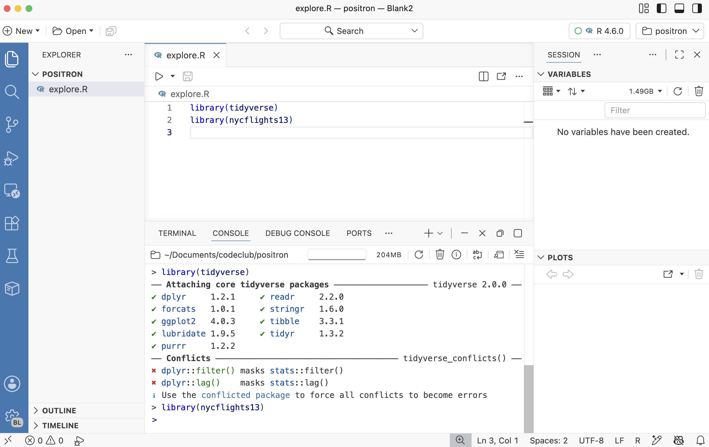{fig-align="center" width="90%" fig-alt="Screenshot of the Positron IDE, with the Editor, Console, and various panes"}

### The five regions

{.no-border fig-align="center" width="98%" fig-alt="Diagram of the Positron interface, with the five regions labeled: Editor, Panel, Activity Bar, Primary Side Bar, Secondary Side Bar. Image from <https://positron.posit.co/layout.html>"}

| Region                 | Where           | What's in it                                                   |
| ---------------------- | --------------- | -------------------------------------------------------------- |
| **Editor**             | Center - top    | Open scripts and other documents, in tabs                      |
| **Panel**              | Center - bottom | R console and Terminal                                         |
| **Activity Bar**       | Far left        | Icons that *switch* what the Primary Side Bar shows            |
| **Primary Side Bar**   | Left            | Explorer (files), Search, Source Control, Extensions, Packages |
| **Secondary Side Bar** | Right           | Variables, Plots, Help, Viewer, History, Connections                    |

: {.striped tbl-colwidths="[20, 18, 62]"}

<hr style="height:1pt; visibility:hidden;" />

Almost every pane in Positron can be **resized** (like in RStudio) and
**dragged somewhere else** (much more flexible than in RStudio).
There are also layout presets.

<hr style="height:1pt; visibility:hidden;" />

::: exercise
####  Exercise: Modify the layout {-}

- Resize panes such as the Primary Side Bar and the Editor.

- Drag the **Help** tab down to the bottom, next to the Console,
  and see whether you prefer it there. Drag it back if you want.

- Try moving something else. If you make a mess of things,
  you can always get back to the default layout with the
  *View: Reset View Locations* command.

- **Explore the presets**: Open the Command Palette
  (<kbd>Cmd</kbd>/<kbd>Ctrl</kbd>+<kbd>Shift</kbd>+<kbd>P</kbd>) and type `layout`.
  Select "**Customize Layout...**" and you should see several options for layout presets.
  Try them.

- The Customize Layout dialog also lets you **hide or move regions** ---
  these options are below the presets.
  For example, try clicking on Activity Bar to hide it.

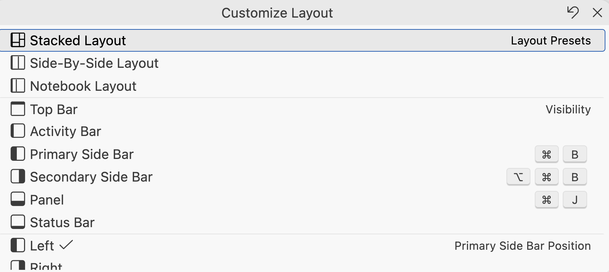{fig-align="center" width="70%" fig-alt="Screenshot of the Positron Customize Layout dialog"}
:::

<hr style="height:1pt; visibility:hidden;" />

::: {.callout-note collapse="true"}
#### Where did my RStudio pane go? _(Click to expand)_

| In RStudio             | In Positron                                        |
| ---------------------- | -------------------------------------------------- |
| Source pane            | Editor (center)                                    |
| Console                | Console (bottom)                                   |
| Environment            | **Variables** pane (right)                         |
| Plots                  | **Plots** pane (right)                             |
| Help                   | **Help** pane (right), or press `F1` on a function |
| Files                  | **Explorer** (Activity Bar, far left)              |
| Packages               | **Packages** pane (Activity Bar)                   |
| Git                    | **Source Control** (Activity Bar)                  |
| Viewer                 | **Viewer** pane (right)                            |
| Terminal               | A tab next to the Console                          |
| History                | **History** pane (right)                           |
| Build                  | *No pane* --- use the Command Palette              |
| `View(df)` data viewer | **Data Explorer** (opens as an editor tab)         |

: {.striped .hover}
:::

<hr style="height:1pt; visibility:hidden;" />

### The Activity and Primary Side Bars

The **Activity Bar** is the strip of icons on the far left.
Clicking an icon swaps out what's shown in the **Primary Side Bar** right next to it.
Among the options are:

#### Explorer

The **Explorer** (the top icon, looks like stacked documents) shows the
folders and files in your currently open folder.
Clicking a file will open it in the Editor.

This is Positron's equivalent of RStudio's **Files** pane,
but a bit nicer as you can see the whole project's structure at once and
expand/collapse subfolders.

::: {.callout-tip}
#### A faster way to jump to a file: Cmd/Ctrl+P

Especially when your project has many subfolders and files,
it can be tedious to click through the Explorer tree to find a file.
The **Go to File** feature is a faster way to jump to a file in your project,
as long as you know part of its name (this is similar to RStudio's **Go to File/Function**).

Try it: press <kbd>Cmd</kbd>/<kbd>Ctrl</kbd>+<kbd>P</kbd>
and type `expl` --- your `explore.R` script should be the top hit.
Press <kbd>Enter</kbd> to jump to it.
:::

#### Search

The **Search** pane lets you search,
and optionally replace, text across _every file_ in your open folder.

Try it: open Search by clicking the **Search** icon (magnifying glass)
in the Activity Bar, then type `tidyverse` in the search box.
Currently, there's only one match, but we'll see more later.
Note that you can click on a result to jump straight to that line.

This is especially useful once your project grows to span multiple scripts.
For example, finding every place you reference a column name
before renaming it, or every script that loads a particular package.

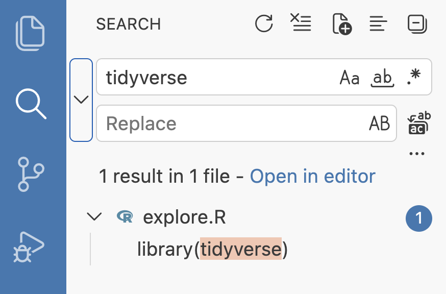{fig-align="center" width="55%" fig-alt="Screenshot of the Positron Search pane, showing a search for 'tidyverse' and one match in explore.R"}

::: exercise
####  Exercise: Search and replace {-}

1. Create a second script in your folder, `plots.R`
   with these two lines in it:

   ```r
   library(tidyverse)

   # TODO: plot the distribution of arr_delay for the flights data
   ```

2. Now that your project has two files,
   use **Search** to look for `tidyverse` again,
   paying attention to how the results are reported and organized.

3. Type `tidymodels` in the search box's **replace** field:
   Positron previews every change it *would* make, right in the results list.
   Have a look --- then clear the replace field,
   since we don't actually want to rename anything.

:::

#### Other sidebar options

There are a few more icons in the Activity Bar:

- **Source Control**: for Git (also much improved over RStudio's Git pane!)
- **Run and Debug**: for debugging code
- **Remote Explorer**: for remote connections
- **Extensions**: for installing add-ons --- more on that in a minute
- **Testing**: for running tests on your code
- **Packages**: lists installed R/Python packages
  (Positron's equivalent of RStudio's Packages pane)

::: exercise
####  Bonus exercise: Explore the Packages pane {-}

Click on the **Packages** icon (cube shape) in the Activity Bar,
and you'll see every package installed in your library, with:

- its *version*, and whether it's attached (i.e. you ran `library()` on it)
- a filter to show only *outdated* packages
- buttons to *install*, *update*, and *remove* packages
- links to each package's documentation and website

Explore this and try, for example,
to filter to outdated packages (if any), and optionally update one or two of them.
:::

## Exploring data

Now, we'll use the flights data to explore some of Positron's data exploration features.

To start, `nycflights13` provides the `flights` data frame,
but it won't show up as an object in your environment yet.
Add the following line to `explore.R` and run it:

```{r}
flights <- flights
```

### The Variables pane

Look at the **Variables** pane on the right: `flights` should now be listed there.
It's the equivalent of RStudio's Environment pane, and like there,
you can **expand objects** to look inside them by clicking the arrow next to an
object's name.

Try expanding `flights`.
You should see each column, its type, and a preview of its contents.

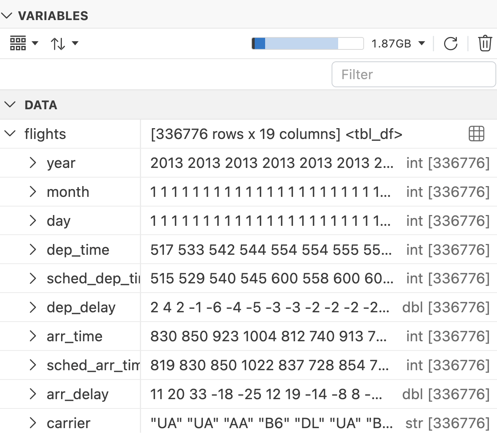{fig-align="center" width="55%" fig-alt="Screenshot of the Positron Variables pane, showing the flights data frame"}

### The Data Explorer

The Data Explorer is Positron's equivalent of RStudio's `View()` function,
but with a lot more functionality.
Click the small **table icon** next to `flights` in the Variables pane,
and it should open _as an editor Tab_ and look something like this:

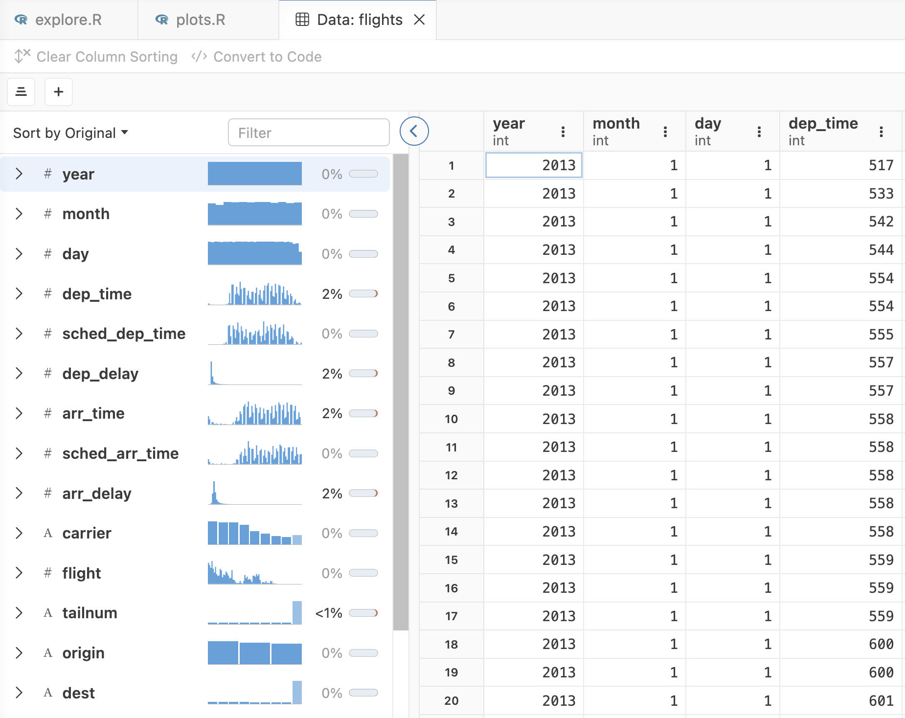{fig-align="center" width="85%" fig-alt="Screenshot of the Positron Variables pane, showing the flights data frame with a small table icon next to it"}

The Data Explorer has three parts:

- The **data grid** --- the spreadsheet-like view of your rows and columns
- The **summary panel** --- per-column statistics and a small distribution plot.
  _[May be hidden by default: if you don't see it, look for an arrow on the left-hand side of the spreadsheet view.]{style="color: salmon;"}_
- The **filter bar** --- for temporarily filtering rows

#### Sorting and filtering

- **Sort** by clicking the three dots in the column header and picking
  `Sort Ascending` or `Sort Descending`.

- **Filter** by clicking `+ Add Filter` in the filter bar,
  picking a column, and choosing a condition.
  You can add several filters, and they will combine.

Sorting and filtering in the Data Explorer **does not** change the dataframe in your R session,
but there is a **"Convert to Code" button (!)** that generates the R code to reproduce your filter and sort.

::: {.columns}
::: {.column}

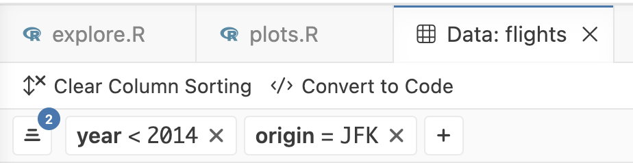{fig-align="center" width="90%" fig-alt="Screenshot of the Positron Data Explorer, showing the Convert to Code button"}

:::
::: {.column}

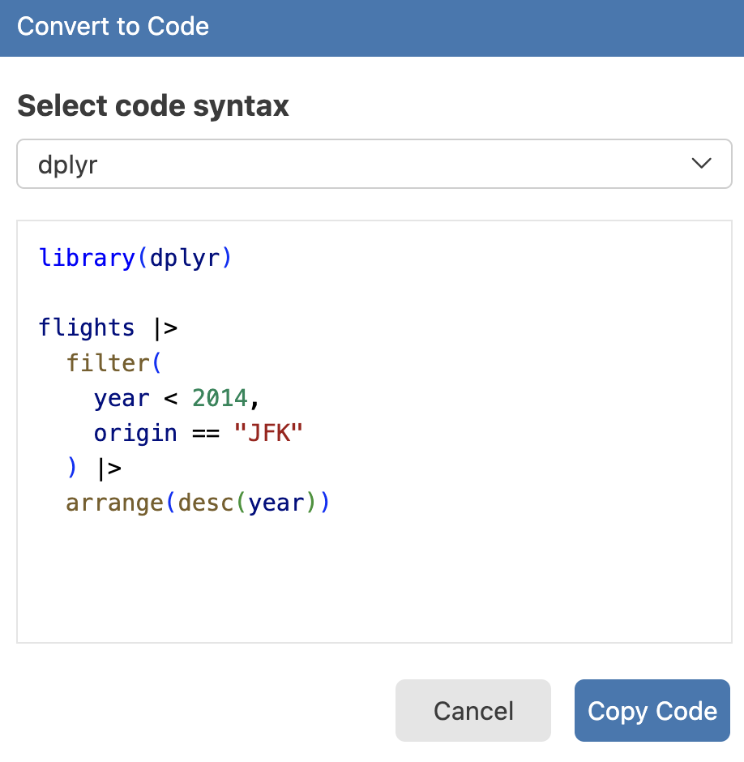{fig-align="center" width="90%" fig-alt="Screenshot of the Positron Data Explorer, showing the generated R code"}

:::
:::

::: exercise
####  Exercise: Explore the flights data {-}

Use the **Data Explorer** to answer these:

1. Which column has the **most missing values**?
   *(Hint: the summary panel shows a missing-value percentage per column.)*

2. How many **distinct airline carriers** (`carrier`) are in the data?

3. Filter to flights that departed from `JFK` **and** had a departure delay
   (`dep_delay`) of more than 120 minutes.
   Roughly how many rows are left?
   *(Look for the row count displayed in the Data Explorer ---*
   *it reflects your active filters.)*

4. Sort those filtered flights by `dep_delay`, descending.
   What was the single worst departure delay out of JFK, in hours?

5. Use the Convert to Code button to get code corresponding to what you did in
   steps 3 and 4, and copy it into your `explore.R` script.

:::

#### Opening data files directly in the Data Explorer

You can **open a data file directly in the Data Explorer**, without any R code
(this is a feature RStudio does not have at all).
Let's start by creating a CSV file from the `flights` dataset,
so we have a data file to work with:

```{r, warning=FALSE}
# Make a copy of the data as a CSV file, so we have a data file to work with
dir.create("data")
write_csv(flights, "data/flights.csv")
```

Next, open `data/flights.csv` via the Explorer or with
<kbd>Cmd</kbd>/<kbd>Ctrl</kbd>+<kbd>P</kbd>.
The file will open directly in the Data Explorer!
And this will also work for `.tsv` and **even `.xlsx` (Excel) files**.

::: callout-tip
#### Want to see the raw text of a data file instead?
For plain-text files, if you want to see the raw text instead of the Data
Explorer, click the "Open as Plain Text File" button:

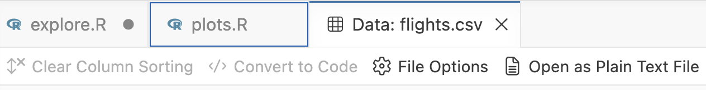{fig-align="center" width="70%" fig-alt="Screenshot of the Positron Data Explorer, showing the Show Plain Text button"}
:::

### Plots

Let's create a plot, so we can see where it appears.
Copy the following code into the `plots.R` script and run it:

```{r}
ggplot(flights, aes(x = arr_delay)) +
  geom_histogram(bins = 100, fill = "steelblue", color = "grey20") +
  geom_vline(xintercept = 0, color = "tomato1", linetype = "dashed") +
  scale_x_continuous(limits = c(-100, 300)) +
  scale_y_continuous(
    expand = expansion(mult = c(0, 0.05)),
    labels = scales::comma_format()
  ) +
  labs(x = "Arrival delay (minutes)", y = "Number of flights") +
  theme_bw(base_size = 14) +
  theme(panel.grid.minor = element_blank())
```

The **Plots** pane behaves much like RStudio's, including the back/forward
arrows through your plot history.
Two things to try:

- The **expand** button, which pops the plot out into a large editor tab.
- Click the **circle icon** (to the right of "Auto"), and you should see options
  "Dark Filter" and "Follow Theme" (and the default "No Filter"):
  Dark Filter will show the plot on a dark background, and Follow Theme will
  match your color theme. Handy for those who prefer a dark theme for their IDE!

::: callout-note
#### The Help pane
Like in RStudio, you can get help on a function by typing `?function_name` in the console,
or by putting your cursor inside a function name in your script and pressing <kbd>F1</kbd>.
Give one or both methods a go with `geom_histogram`.
:::

## Customize Positron

Let's finish by looking at some ways to customize Positron to your liking.

### Extensions

Positron has _many_ extensions (add-ins) that you can install,
in large part because most **VS Code extensions** are compatible with Positron.
To find and install extensions, click the **Extensions** icon in the Activity Bar
(four blocks, with one set apart from the other three).
Some useful ones:

| Extension                             | What it does                                                  |
| ------------------------------------- | ------------------------------------------------------------- |
| **Code Spell Checker**                | Underlines misspelled words in code and prose                 |
| **Better Comments**                   | Color-codes certain comments by type (TODOs, questions, etc.) |
| **Pastum**                            | Converts a table copied to your clipboard (!) [^1]            |
| **Indent Rainbow**                    | Colorizes indentation levels in scripts                       |
| **Rainbow CSV**                       | Colorizes CSV columns when viewing as plain text              |
| **Air**                               | R code formatter                                              |
| **Quarto**                            | Quarto support                                                |
| **Tomorrow Night Bright (R Classic)** | The RStudio color theme                                       |
| **SVG Preview**                       | Enables viewing of `.svg` files                               |

: {.striped}

[^1]: For example, a table copied from a webpage directly into R, Python, Julia, SQL, or Markdown code.

#### Automatic code formatting

Let's try the **Air** extension: find it in the Extensions marketplace and install it.
Then, type some deliberately messy code into `explore.R`:

```r
x=c(1,2,   3,4)
y   <-1:10
```

Open the Command Palette and run *Format Document*.

Let's try it with one other example --- add this to `plots.R`:

```r
ggplot(flights, aes(x = arr_delay)) + geom_histogram(bins = 100, fill = "steelblue", color = "grey20") +
  scale_y_continuous(expand = expansion(mult = c(0, 0.05)), labels = scales::comma_format())
```

::: callout-tip
#### Want to always format code when you save a file?
Look for `editor.formatOnSave` further down on this page.
:::

### Settings: the UI and the JSON file

The main way to change Positron's settings is the **Settings UI**:
open the Command Palette and run *Preferences: Open Settings (UI)*.
We'll explore some Editor-related settings next.

::: {.callout-note collapse="true"}
#### `settings.json` and user vs. workspace settings _(Click to expand)_

Under the hood, every setting lives in a `settings.json` file, which you can
edit directly via *Preferences: Open User Settings (JSON)*.

This can be useful because, for example, it lets you paste in a whole
block of settings someone shared with you,
and makes it easy to copy your entire configuration to a new computer.
Occasionally, it's also the only way to reach a setting that isn't
yet exposed in the UI.

------

Settings come in two levels:

- **User** settings apply everywhere, across every folder you open ---
  these are your personal preferences, like a theme or keybindings.
- **Workspace** settings apply only to the current folder, and get saved
  in a `.vscode/settings.json` file inside it.

Workspace settings override user settings when the two conflict. Unless
you have a specific reason to limit a setting to one project,
change **user** settings by default,
so your preferences carry over to every new folder you open.
:::

### Editor features and settings

#### Side-by-side editors

Drag a tab to the left or right edge of the Editor area
(or use *View: Split Editor* from the Command Palette)
to view two files at once, side by side.
This is useful for comparing two scripts,
or keeping a script and a data file's Data Explorer view open together.

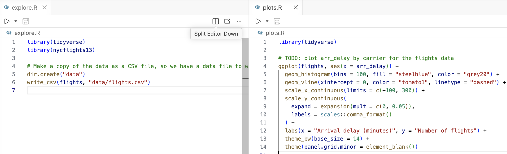{fig-align="center" width="95%" fig-alt="Screenshot of the Positron IDE, showing two editor tabs side by side"}

#### Preview mode

By default, clicking a file opens it in **preview mode**:
the tab title shows in italics, and opening a *different*
file this way reuses that same tab instead of opening a new one.
This can be handy to prevent your tab bar from filling up with files you only glance at,
but takes some getting used to.

Once you start editing a file, the tab becomes permanent and is no longer in preview mode.
But sometimes you want to keep a file open even if you haven't edited it yet.
You can do this in two ways:

- **Double-click** the file to open it in a permanent tab to begin with, or
- For a file in preview mode, with your cursor in the file,
  use the <kbd>Cmd</kbd>/<kbd>Ctrl</kbd>+<kbd>K</kbd> <kbd>P</kbd> shortcut to
  make it permanent.

If you really don't like preview mode, you can turn it off entirely with the setting
`workbench.editor.enablePreview: false`.

#### A few more settings and features

- `files.autoSave` ---
  saves files automatically; some people love this, others hate it, try it and see.

- `editor.rulers: [80]` --- draws a thin vertical guide line at column 80,
  helping you keep lines from getting too long (a common style convention
  in R). Off by default; add more numbers to the list for multiple guides.

- `editor.formatOnSave` ---
  automatically formats code when you save a file, if you have a formatter installed
  (we do --- we installed Air above).

::: {.callout-warning}
#### Watch out: copying with nothing selected

If you press <kbd>Cmd</kbd>/<kbd>Ctrl</kbd>+<kbd>C</kbd> with no text selected, Positron (like VS Code)
copies the **entire current line** instead of doing nothing.
This is quite handy but can also catch you off guard.
**Try it**: click somewhere in a line of your script *without selecting anything*,
press <kbd>Cmd</kbd>/<kbd>Ctrl</kbd>+<kbd>C</kbd>, and then paste on an empty line below.

If you don't want this behavior, you can turn it off with:

```json
"editor.emptySelectionClipboard": false
```
:::

::: callout-tip
#### Want more space for your editor and panes?
If you want to maximize the horizontal space for your editor and panes,
you can move the Activity Bar from the left side to the top of the window,
next to the menu bar, with the setting `workbench.activityBar.location: "top"`.
Try it!
:::


::: {.callout-note collapse="true"}
#### Multiple cursors _(Click to expand)_

Multiple cursors work much as in RStudio (<kbd>Alt</kbd>+click,
<kbd>Ctrl</kbd>+<kbd>Alt</kbd>+arrow keys),
but Positron adds a handy way to build a multi-cursor selection from *matching text*:

- <kbd>Cmd</kbd>/<kbd>Ctrl</kbd>+<kbd>D</kbd> adds the **next occurrence**
  of whatever you have selected --- press it repeatedly to build up the
  selection one match at a time.
- <kbd>Cmd</kbd>/<kbd>Ctrl</kbd>+<kbd>Shift</kbd>+<kbd>L</kbd> selects
  **all occurrences** in the file at once.
- <kbd>Esc</kbd> returns you to a single cursor.

This is a quick way to rename a variable or column throughout a script,
without a find-and-replace.
:::

### Keyboard shortcuts (keybindings)

Open the Command Palette and run *Preferences: Open Keyboard Shortcuts* to see
every action (command) you can perform in Positron,
and their current shortcut (if it has one) in a searchable list ---
type a command name or describe the action you want (e.g. `run line`) to find it.

You can click any row to record a new shortcut, and right-click to reset it back to default.

::: {.callout-note collapse="true"}
#### Get your RStudio keybindings back _(Click to expand)_

Many RStudio shortcuts already work in Positron, but others don't,
because Positron inherits VS Code's shortcuts, which sometimes conflict.
But if you're really used to the RStudio keybindings, and want to keep using those,
you can essentially restore them.

Open the Command Palette and run *Preferences: Open Settings (UI)*,
then search for `rstudioKeybindings` and check the box:

```json
"workbench.keybindings.rstudioKeybindings": true
```

**Restart Positron** for it to take effect.
This turns on a large set of RStudio shortcuts, including:

| Shortcut                                  | Action                       |
| ----------------------------------------- | ---------------------------- |
| <kbd>Ctrl</kbd>+<kbd>1</kbd>              | Focus the Source/Editor pane |
| <kbd>Ctrl</kbd>+<kbd>2</kbd>              | Focus the Console            |
| <kbd>F2</kbd>                             | Go to definition             |

: {.striped tbl-colwidths="[20, 80]"}

:::

<hr style="height:1pt; visibility:hidden;" />

::: exercise
####  Exercise: Customize Positron {-}

Spend a few minutes setting Positron up the way you like it. For example:

1. Turn on **RStudio keybindings**.

2. Change some **settings** from the list above
   or find your own by browsing the Settings UI.

3. Install an **extension** that looks useful to you.
:::

<hr style="height:1pt; visibility:hidden;" />

::: exercise
####  Bonus exercise: Open one of your own projects {-}

1. Use `File` > `Open Folder...` to open a folder that corresponds to one of your
   own projects with R scripts and data files.

2. Open a script you know well, and run the first few lines of it.

3. Open one of your own data objects in the **Data Explorer**.

Does anything stand out?
:::

<hr style="height:1pt; visibility:hidden;" />

:::: callout-note
#### Further resources

- The [Positron documentation ](https://positron.posit.co/){target="_blank"}
- The [migration guide for RStudio users ](https://positron.posit.co/migrate-rstudio.html){target="_blank"}
- An walkthrough within VS Code:
  open the Command Palette, run *Welcome: Open Walkthrough...*,
  and pick one, such as "Migrating from RStudio to Positron".
- [Video: Tips & tricks from the maintainers of Positron ](https://www.youtube.com/watch?v=7Tog8OkrIWI){target="_blank"}
- [Video: Exploring Positron settings ](https://www.youtube.com/watch?v=QIYyeuZ_ISY){target="_blank"}
- The [VS Code documentation ](https://code.visualstudio.com/docs){target="_blank"}
  --- note that most VS Code documentation applies, since Positron is built on it.

:::
