------------------------------------------------------------------------

<br>

# Introduction

## What we'll cover

Developments in generative artificial intelligence (AI) using large language models (LLMs) is revolutizing the way the people code. We have covered in [many past Code Clubs](https://osu-codeclub.github.io/#category=ggplot2) how to use `ggplot2` in R to make the plots of your dreams, and today we are going to talk about aiding that process using AI.

By the end of the session, you should be more comfortable with using AI to aid in your plotting. Specifically, we'll cover:

-   The basics of `ggplot2` syntax
-   Using AI to make a simple plot
-   Using prompts to refine that plot more
-   Prompting to make a much more complicated figure

::: exercise
###  Discussion {.unnumbered}

-   Do you currently use AI to help with your plotting?
-   If yes, how do you integrate AI into your workflow?
-   Do you consider yourself familiar with the basics `ggplot2`?
:::

## Before we start

We are going to be working in Positron for the rest of the semester. If you haven't done so already, please:

1.  **Install Positron**: download the appropriate installer from the [download page](https://positron.posit.co/download.html){target="_blank"}, and run it. There are installers for Windows, macOS, and Linux.

2.  **Make sure you have a recent R** (4.4.0 or higher) installed; Positron does not come with its own copy of R.

::: callout-important
### Using an OSU-managed computer and have no admin rights?

You should still be able to install Positron, just do so at the user level rather than system-wide.

On a Mac, this involves dragging the Positron app into your **User** Applications folder, `/Users/<username>/Applications` (i.e. this Applications folder is in the same parent folder as your Documents, Downloads, and Desktop folder).

On Windows, the Positron installer has a **"User install"** option. Look for a checkbox or dropdown labeled **"Install for me only"** (vs. "for all users") during setup --- that keeps the install in your user profile without needing admin rights.
:::

# Getting started

Go ahead and start Positron! It should look something like this:

{fig-align="center" width="98%" fig-alt="Screenshot of the Positron IDE, with the Editor, Console, and various panes"}

## Opening a folder (replaces RStudio Projects)

::::: columns
::: {.column width="45%"}
On the left side of the Positron window, you should see something similar to what's shown in the screenshot on the right, prompting you to **open a folder**.

"Opening a folder" is Positron's **equivalent of opening an RStudio Project**. The idea is the same: a folder is a self-contained workspace, and opening it sets your working directory and gives you a fresh R session.

But instead of requiring the special `.Rproj` file that is created when you make an RStudio Project, Positron simply **treats any folder you open as a project**.
:::

::: {.column width="55%"}
{fig-align="center" width="80%" fig-alt="Positron welcome screen, with a button to open a folder"}
:::
:::::

 Let's open a new folder for today's session:

1.  You can use the folder you created last month when you [learned about Positron from Jelmer](https://osu-codeclub.github.io/posts/S12E01_positron_01/), or you can create a new folder to use today. You can create it in any way, such as with your computer's File Explorer / Finder.

    I would suggest putting this folder within a folder for Code Club, for example: `Documents` \> `codeclub` \> `26-au` (or put another way: `~/Documents/codeclub/26-au`). Again, it would be fine to use the same folder from our August session.

2.  Open this folder in Positron by clicking the **Open Folder** button shown above[^1].

3.  Positron will reload and ask whether you want to trust the folder. Click **Yes, I trust the authors** and optionally check the box above it.

[^1]:  Or if that's somehow not showing, by using the menu `File` \> `Open Folder...`.

{fig-align="center" width="60%" fig-alt="Positron dialog asking whether to trust the folder you just opened"}

**Why are Projects or open folders needed?** These encourage good practices:

-   Keep each research project in its own self-contained folder
-   Use paths *relative* to the folder root, not absolute paths
-   Avoid using `setwd()`

They also make a lot of Positron's features work better, such as the Explorer, Search, and version control support.

## Setting up Positron to use GitHub Copilot with Posit Assistant 

You can set up Posit Assistant to work with a variety of different LLMs. Today we will set it up for using GitHub Copilot. 

The two main AI tools we have are:

1. Code completions where you get AI suggested completions as you type
2. Agentic chat using Posit Assistant where you can both get code suggestions and have the agent run the code for you.

### Get a GitHub account if you don't have one

In order to use GitHub Copilot with Posit Assistant, you must have a GitHub account.

Create a GitHub account by going to [github.com/join](www.github.com/join).

-   You will have to link to an email address. You can use your OSU email or a personal one, it doesn't matter.
-   You will have to pick a username. Some [advice for picking a username](https://happygitwithr.com/github-acct.html):
    -   Incorporate your actual name - it's useful for seeing who you are
    -   Pick a username you'd be comfortable with an employer seeing
    -   Shorter is better
    -   Recommend to use all lower case letters
    -   Your username can be changed but its annoying so try and get it right the first time

::: callout-tip
You can sign up for GitHub education with your OSU email by confirming your status as a student [GitHub Education page](https://github.com/education).
:::

Anyone with a GitHub account will be automatically enrolled in the free GitHub Copilot plan,
which has a limit of 2,000 code completions per month and ~50 chat requests.
That's not enough for most people to use GitHub Copilot in a sustained way ---
but as students and teachers/faculty, we can get additional free access after applying for it.
In summary (see also this [GitHub page](https://docs.github.com/en/copilot/concepts/billing/individual-plans)):

| Plan | Free for whom | How to get it | Code completions | Chat requests |
|------|----------|------------------|---------------|---------------|
| **Free** | Everyone | Automatically | 2,000 per month | ~50 |
| **Student** | Students | Apply for education benefits | Unlimited | 200 |
| **Pro** | Teachers/Faculty | Apply for education benefits | Unlimited | 1,500 |

To apply for educational benefits,
the following link will work for teachers/faculty and students alike ---
just select the appropriate option in the form:

1. Go to <https://github.com/settings/education/benefits>.

2. Click "**Start an application**":

3. Fill out the form as needed.
   _(You will likely need a document that proves your current status at the university.)_

### Set your LLM provider to GitHub Copilot

In order to set up the Posit Assistant for AI-assisted plotting, you will need to configure the Posit Assistant extension. We will configure it to use GitHub Copilot.

:::{.callout-note}
# Want to set up with a different LLM? 
Jelmer has created [some intructions](https://cfaes-bioinfo.github.io/agentic-ai-workshop/o3-positron-install.html#authentication-via-the-osu-litellm-api) for how to set up Claude Code using your OSU LiteLLM API 
:::

To do that, call up your Command Palette (<kbd>Cmd</kbd>/<kbd>Ctrl</kbd>+<kbd>Shift</kbd>+<kbd>P</kbd>), and we are going to configure which LLMs our Posit Assistant can use. Type in "*Authentication: Configure Language Model Providers*" and select it.

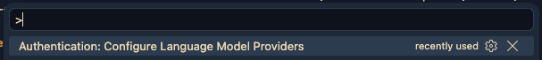{fig-align="center" width="80%" fig-alt="Authentication: Configure Language Model Providers"}

::: {.callout-note collapse="true"}
### Don't see Authentication: Configure Language Model Providers as an option?_(Click to expand)_

This may be because:

- You have an old version of Positron installed. Go to the [Positron site]() and download/install the newest version.
- You don't have the Posit Assistant extension installed.
  1. Open the Extensions view in Positron by clicking the Extension icon in the Activity Bar (the narrow leftmost sidebar).
  2. In the search box, start typing "Posit Assistant"
  3. Click Install on the "Posit Assistant" extension by Posit Software, PBC.

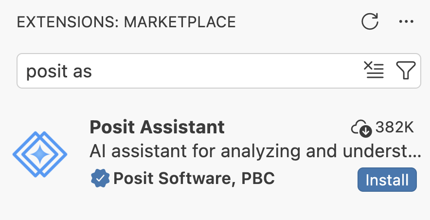{fig-align="center" width="80%" fig-alt="Posit Assistant extension in the Extensions view of Positron"}

:::

This will prompt opening a new window where you can select which LLM provider you want to use. There are more options than what you can see in the screenshot below.

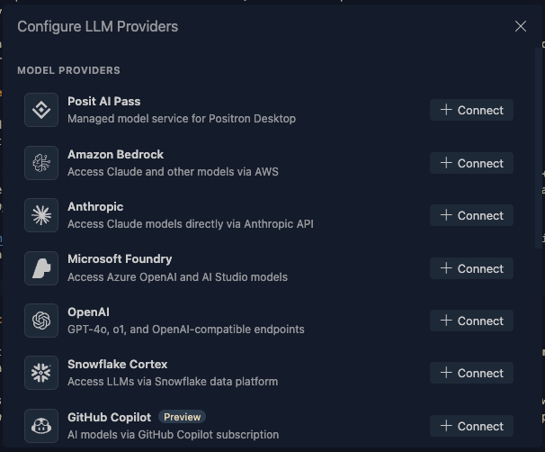{fig-align="center" width="80%" fig-alt="Configure Language Model Providers"}

Today we are going to select GitHub Copilot, which is free to use for students and academics. You will need to have a GitHub account and sign in to GitHub Copilot. Go ahead and click the orange `Connect` Positron to GitHub Copilot. A new pop up with open that says "The extension 'Authentication' wants to sign in using GitHub. Click the blue `Allow`. This will open a new browser window where you can sign in to GitHub and authorize Posit Assistant to use GitHub Copilot.

::: {.columns}
::: {.column width="70%"}

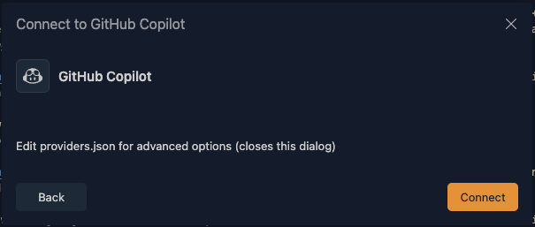{fig-align="center" width="80%" fig-alt="Connect to GitHub Copilot"}


:::
::: {.column width="30%"}

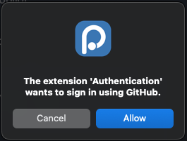{fig-align="center" width="50%" fig-alt="The extension 'Authentication' wants to sign in using GitHub"}

:::
:::

Next you will get popup that includes a code for authenticating in your browser. You can click `Copy & Continue to Browser` and the 8 digit code will be added to your clipboard and a browser will open.

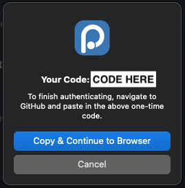{fig-align="center" width="50%" fig-alt="A pop up including your code for authenticating with GitHub."}

You will need to be logged into a GitHub account to do this - you can see that mine shows up below. You might also have the option here to log in.

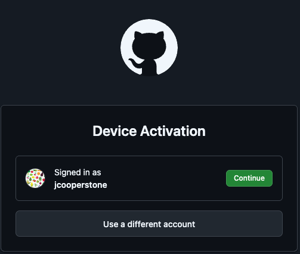{fig-align="center" width="50%" fig-alt="Selecting a log in for activating your device with GitHub"}

Now you can authorize your device to use GitHub Copilot with Positron. Your code should be ready in your clipboard, you can paste it here using (<kbd>Cmd</kbd>/<kbd>Ctrl</kbd>+<kbd>V</kbd>)

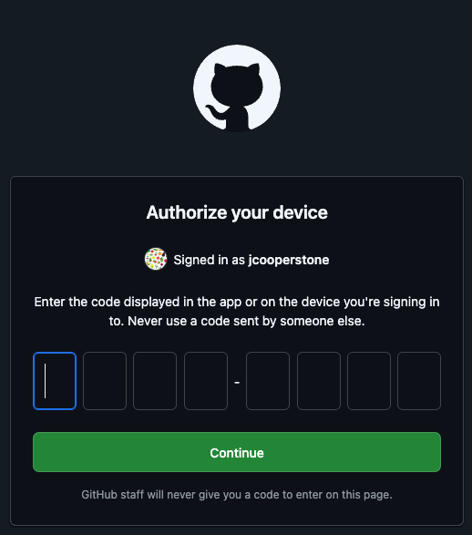{fig-align="center" width="50%" fig-alt="Authorize your device by entering the code you previously copied to your clipboard. It also says what GitHub user you are signed in as"}

Now you can authorize VS code to access items within your GitHub account.  Yours might look different than mine depending on what groups you are involved with. You can press the green button to `Authorize Visual-Studio-Code`.

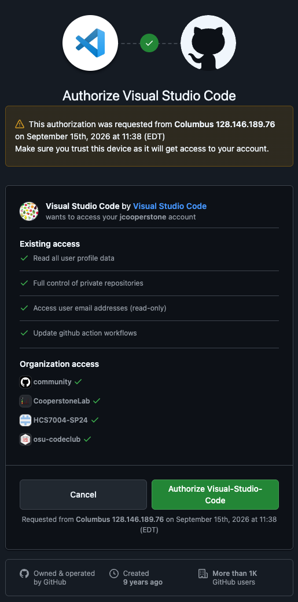{fig-align="center" width="50%" fig-alt="Authorize yVS Code to access your GitHub account with the username you've previously indicated. This allows existing access to reading user profile data, controlling private repos, access user email address and update github action workflows. along with some community access."}

Now you should be connected.

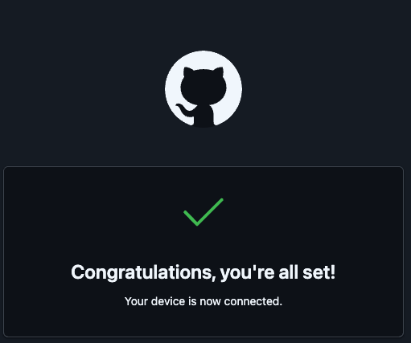{fig-align="center" width="50%" fig-alt="Congratulations! You have successfully connected to GitHub Copilot!"}

::: {.callout-note collapse="true"}
### Getting a popup that you have not finished authorizing GitHub?  There are some instructions below to authorize by creating a Personal Access Token (PAT) _(Click to expand)_

While preparing the material for today's session, I set up GitHub Copilot in Positron about 5 times. Sometimes when I would set up, I would get the pop up on the bottom right of my Positron window:

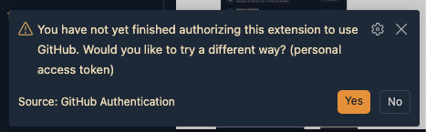{fig-align="center" width="50%" fig-alt="You have not yet finished authorizing this extension to use GitHub. Would you like to try a different way? (personal access token)."}

If you get this prompt, you can click the orange `Yes`. This will initiate a new popup that asks if you want to Continue to GitHub to create a Personal Access Token (PAT). You can click the blue `Continue to GitHub`.

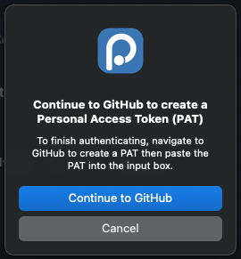{fig-align="center" width="50%" fig-alt="A pop up asking if you want to Continue to GitHub to create a Personal Access Token (PAT)."}

You should next get a popup asking "Do you want Positron to open the external website?" and you can click the blue `Open`.  

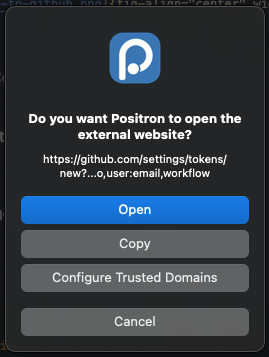{fig-align="center" width="50%" fig-alt="Positron is asking if you want Positron to open the external website."}

This will bring you to your GitHub account online where you can create a Personal Access Token (PAT). You can do this with all the defaults, and you will need to set an expiration date. GitHub recommends you set at 30 days but you can do longer. If you scroll to the bottom of hte page, you will find a green `Generate token` button - go ahead and click that.

Your PAT will then be created and you can see it. Be sure to copy this, and I like to save this token also in my password manager. Then you can navigate back to Postrion where there should be a prompt asking you for this PAT.

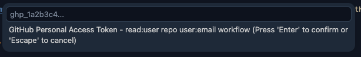

Paste your PAT and press `Enter`. You should now be connected to GitHub Copilot through Positron.

:::

## Starting an R session

Near the **top-right corner** of the Positron window is the so-called **interpreter picker**, which lets you choose which installation of R (or Python) to use for your session.

If Positron found your R installation, it may have started a session already --- then it would *look similar to what's shown in the screenshot on the right* (with the R version number corresponding to what *you* have installed).

# Re-familiarizing ourself with `ggplot2` syntax

Perhaps it is possible now to use AI to make your plots without understanding any `ggplot2` or `R` syntax, but I do think it is much easier, and you'll have a better time if you understand the basics.

## Installing and loading the `tidyverse`
Before we start going through the syntactical basics, we need to have `ggplot2` installed in R. If you were here last time, you'll already have the `tidyverse` (and `ggplot2` is one of the packages contain in this meta-package), but if you weren't then you will need to first download it using `install.packages()`. Then you can load the `tidyverse` by calling it with the function `library()`.

```{r}
library(tidyverse)
```

::: {.callout-tip}
### Prefer that your output be displayed in the source editor?
If you liked that output would be shown in the source editor, directly below code, like you might be used to in RStudio, you can enable inline output by turning on [quarto.inlineOutput.enabled](positron://settings/quarto.inlineOutput.enabled). 

:::

We are going to use the `penguins` dataset that comes preloaded with base R. If you want to see all of these datasets, you can run `library(help = "datasets")`

```{r}
glimpse(datasets::penguins)
```

I am clipping below a bit of the []`ggplot2` cheatsheet](https://github.com/rstudio/cheatsheets/blob/main/data-visualization.pdf) to see how the developesr explain the basis of plotting.


The general syntax is like this:

```{r eval = FALSE}
data |> # start with dataframe and pipe to ggplot()
  ggplot(aes(x = _x-variable_, # inside aes set variables mapped to visual aspects
             y = _y-variable_, 
             color = _color-variable)) + 
    geom_*() + # add a geometry - the type of plot
    scale_*() + # set how data maps to visual aspects 
    theme_*() + # adjust the overall look of the plot
    labs() + # add labels - title, axes, legend
```

You can find the full `ggplot2` [cheatsheet](https://github.com/rstudio/cheatsheets/blob/main/data-visualization.pdf) also for reference.

# Simple plots

Let's start with with asking the Posit Assistant for help with a plot. Let's ask for:

> "Create a plot using the penguins dataset that plots flipper length versus bill length."

When I did this for the first time, I got a pop up asking "Can Posit Assistant use executeCode?" This would mean that the Posit Assistant would like to actually run this code, versus just provide the code for me to run.

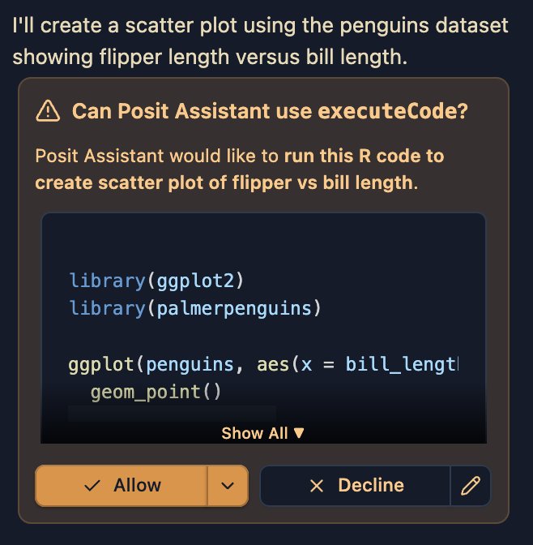{fig-align="center" width="50%" fig-alt="Posit Assistant asking if it can execute code."}

I am going to click `Allow` and see what happens. Alternatively you could click `Deny` and the Posit Assistant will provide you with code that you can copy and paste into your script or `.qmd` file to run.

When I do this, I get the following code, which I can see in my console:

```{r}
library(ggplot2)
library(palmerpenguins)
 
ggplot(penguins, aes(x = bill_length_mm, y = flipper_length_mm)) +
  geom_point()
```

There are a few things to note here, Posit AI has:

1. loaded the packages it needs to run the code its specified.
2. decided that the data we want is in the package `palmerpenguins` even though I was expecting it to pull from the base R `penguins` dataset. This is fine, but it is something to be aware of as these two datasets are not identical. For example, the variable names in `palmerpenguins::penguins` are different than in `datasets::penguins`. 
3. not used the pipe `|>` operator which is a more modern way to write code that is considered best practice. This approach is fine but it is something to be aware of.

While this is a very good start, let's see if different prompting can get us a different result. I am now going to ask for:

> "Create a plot using the penguins dataset embedded in base R that plots flipper length versus bill length. Use the pipe operator and add code annotations so I can follow what each line is doing."

When I do this, I get the following code:

```{r, eval = FALSE}
# Load the penguins dataset from datasets package
datasets::penguins |>
  # Extract the columns we need for plotting
  (\(d) data.frame(
    bill_length = d$bill_length_mm,
    flipper_length = d$flipper_length_mm
  ))() |>
  # Remove rows with missing values
  (\(d) d[complete.cases(d), ])() |>
  # Create the plot with bill_length on x-axis and flipper_length on y-axis
  with(plot(
    x = bill_length,
    y = flipper_length,
    main = "Penguin Measurements",
    xlab = "Bill Length (mm)",
    ylab = "Flipper Length (mm)",
    pch = 19,
    col = rgb(0, 0, 0, 0.6)
  ))
```

This code has a number of problems, is actually worse than my first attempt, and does not work for me at all. I notice a few problems:

1. I asked for the `penguins` dataset which is a part of base R, and Posit AI has given me a fully base R plot, which is not what I want. I can change my prompt to fix this problem.
2. Because the assistant thinks I want a base R plot, this leads to addition code which is fully not necessary. There are some steps that aim to extract the columns from the data, which is needed for base R plotting, but this is also done incorrectly. The code we've received is (trying) to extract `bill_length_mm` and `flipper_length_mm` from `penguins` but those are not the correct variable names.

Let's try a new prompt:

> "Create a plot using the data datasets::penguins using ggplot2 that plots flipper length versus bill length. Use the pipe operator and add code annotations so I can follow what each line is doing."

Now I get this code:

```{r eval = FALSE}
library(ggplot2)

# Load the penguins dataset from the datasets package
datasets::penguins |>
  # Initialize ggplot with bill_length_mm on x-axis and flipper_length_mm on y-axis
  ggplot(aes(x = bill_length_mm, y = flipper_length_mm)) +
  # Add a scatter plot layer with semi-transparent points
  geom_point(alpha = 0.6, size = 3) +
  # Add labels for the axes and title
  labs(
    title = "Penguin Measurements",
    x = "Bill Length (mm)",
    y = "Flipper Length (mm)"
  )
```

Better but still I have the wrong variable names. What if I try and give the prompt information about my dataset? I am going to paste the output of `glimpse(datasets::penguins)` into the end of my prompt such that the AI can see exactly what my data looks like.

> Create a plot using the data datasets::penguins using ggplot2 that plots flipper length versus bill length. Use the pipe operator and add code annotations so I can follow what each line is doing. I am pasting below the output of glimpse(datasets::penguins) so you can see what the data looks like.

```{r}
glimpse(datasets::penguins)
```

Ok now I am getting a functional plot:

```{r}
library(ggplot2)

# Load the penguins dataset from the datasets package
datasets::penguins |>
  # Initialize ggplot with bill_len on x-axis and flipper_len on y-axis
  ggplot(aes(x = bill_len, y = flipper_len)) +
  # Add a scatter plot layer with semi-transparent points
  geom_point(alpha = 0.6, size = 3) +
  # Add labels for the axes and title
  labs(
    title = "Penguin Measurements",
    x = "Bill Length (mm)",
    y = "Flipper Length (mm)"
  )
```

I have gotten a little bit more than I asked for - Posit AI decided that the points should be better (`size = 3`) and be a bit transparent (`alpha = 0.6`) which I think is ok. I also have gotten x- and y-axis labels along with a title even though I didn't ask for that.

::: exercise
##  Exercise: Try it yourself

1. Try on your own to prompt Posit AI to make you a new plot with this same data.  Play around and then we will all share our experiences.

2. What have you learned about what makes a successful prompt?
:::

# More complicated plots/involved requests

We've done some simple plots but what if we want to make something much more complicated? We could think about this in two ways:

1. We could ask for a much more customized plot
2. We could see how well we think Posit AI can select a visualization tool without providing that information explicitly.

Let's pick a more involved dataset, one we've used in Code Club before to have more variables to interrogate. The data we are going to download can be found [here](https://www.cia.gov/stories/story/spotlighting-the-world-factbook-as-we-bid-a-fond-farewell/), though I have saved the file, added it to our Code Club Github, and included some code below for you to download it.

```{r eval = FALSE}
download.file(
  url = "https://github.com/osu-codeclub/osu-codeclub.github.io/raw/refs/heads/main/posts/S08E01_wrangling_01/data/factbook.csv",
  destfile = "factbook_download.csv"
)
```

Let's see if we can get Posit AI to read the data in for us. I am going to start with a minimal prompt so we can see how that goes:

> "Read in factbook_download.csv".

Posit AI gave me the following message:

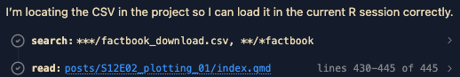{fig-align="center" width="80%" fig-alt="Posit AI message that it is locating the CSV in the project so it can load it into the current R session correctly.."}

```{r eval = FALSE}
factbook <- read.csv("posts/S12E02_plotting_01/factbook_download.csv")
factbook
```

```{r echo = FALSE}
factbook <- read.csv("factbook_download.csv")
```

Let's look at this data, using `glimpse()` (to get a summary).

```{r}
glimpse(factbook)
```

We have some problems here:

1. All data is read in as characters, even those that aren't of the type `character`
2. Since R by default doesn't allow column names to start with a number, an `X` has been added to the beginning of all columns that begin with a number.

Let's see if we can get Posit AI to help us fix this. I am going to prompt:

> "Read in factbook_download.csv. The first four columns should be character type and the rest of the columns are numeric. I want the year columns to start just with the number of the year, with no X preceeding."

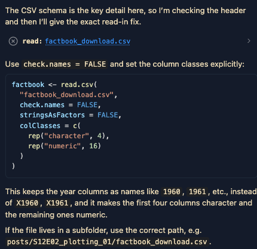{fig-align="center" width="80%" fig-alt="Posit AI message that it is trying to read in my data"}

This is the output I get - and this code doesn't work for me.

```{r eval = FALSE}
factbook <- read.csv(
  "factbook_download.csv",
  check.names = FALSE,
  stringsAsFactors = FALSE,
  na.strings = c("", ".."),
  colClasses = c(
    rep("character", 4),
    rep("numeric", 16)
  )
)
```

In my Quarto document, I have a "Fix" option - and I'm going to try that and see how it works.

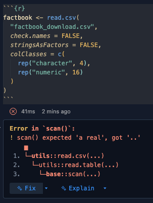{fig-align="center" width="80%" fig-alt="Posit AI message that it is trying to read in my data"}

We get the following code, which runs. Let's look at the message and then we can look at the data to see how it all went.

```{r}
factbook <- read.csv(
  "factbook_download.csv",
  check.names = FALSE,
  stringsAsFactors = FALSE,
  na.strings = c("", ".."),
  colClasses = c(
    rep("character", 4),
    rep("numeric", 16)
  )
)
```

The message we get is:

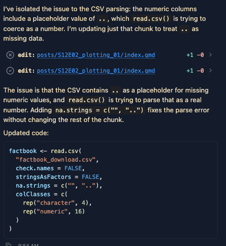{fig-align="center" width="80%"}


```{r}
glimpse(factbook)
```

I am an experienced R user, if I was going to read in this data, I would just have used the code below -- all of our issues are stemming from the fact that missing values are denoted with a non-standard notation of "..". I can just pass to `read_csv()` that the missing values are denoted with ".." and it will read in the data correctly.


```{r}
factbook_jess <- read_csv("factbook_download.csv",
                          na = c("", ".."))

glimpse(factbook_jess)
```

Ok, now that we have data read in - let's play around with prompting for an interesting and progressingly more complicated plot. Let's do this together.